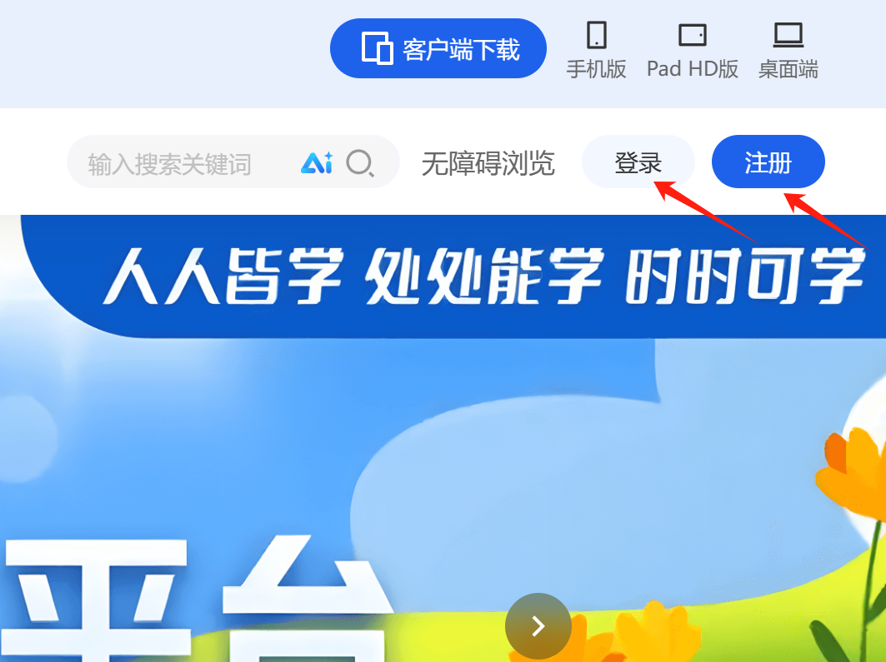
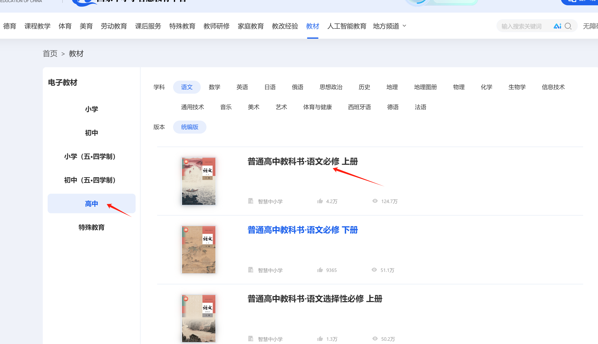
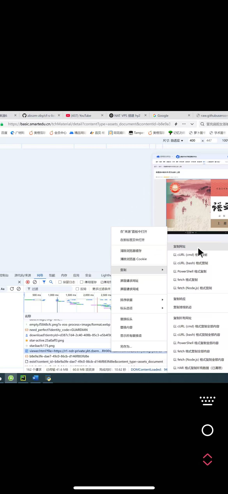
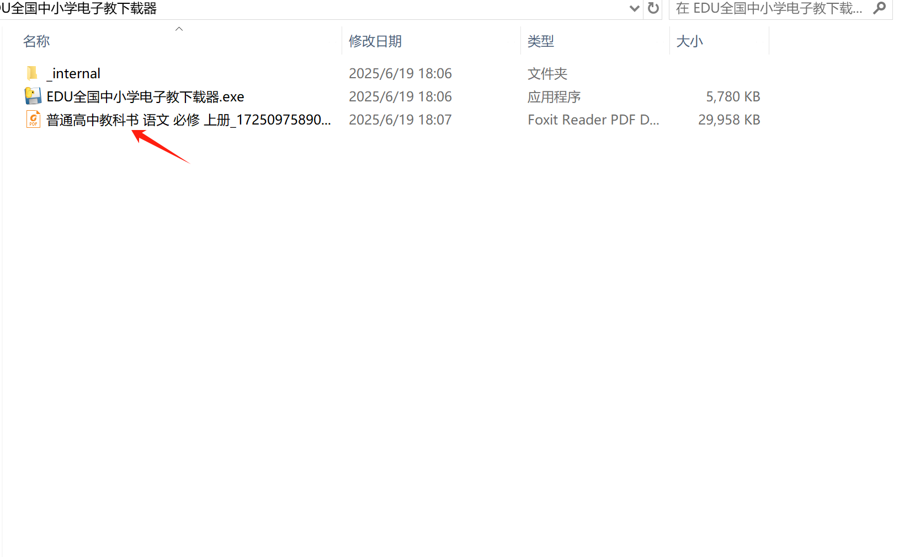

# Teacher-material-downloader
# [国家中小学智慧教育平台 电子课本](https://basic.smartedu.cn/tchMaterial/)下载工具

因国家中小学智慧教育平台的电子教材只能在线观看，不能下载，这样给广大读者带来不便，为方便需要教材电子版本的读者，非凡图书馆特开发了这个小程序。使用操作步骤如下：

一、打开国家中小学智慧教育平台：[https://basic\.smartedu\.cn](https://basic.smartedu.cn)，然后选择：教材。如下图：

进入后点击右上角登录，如未注册的就注册个账号，免费注册的，因为后面预览教材必须要登录才能预览。

二、注册后登录，然后点击要下载的教材，我这随便选择了一本，如下图：

三、点击教材后进入预览界面：

在这个页面中需要进入开发者模式，按F12或在浏览器中选择更多工具，开发人员工具。如下图：

进入开发者模式后，点击全部，然后点击下浏览器的刷新按钮，找到viewer\.html?file=后面一长串地址。如下图这个地址：

四、复制上面这个地址，粘贴到软件教材地址栏中，然后点击下载即可，下载后的pdf电子文件默认保存在软件目录下。如下图：

下载完成后的文件在这里：

教程完！！！
